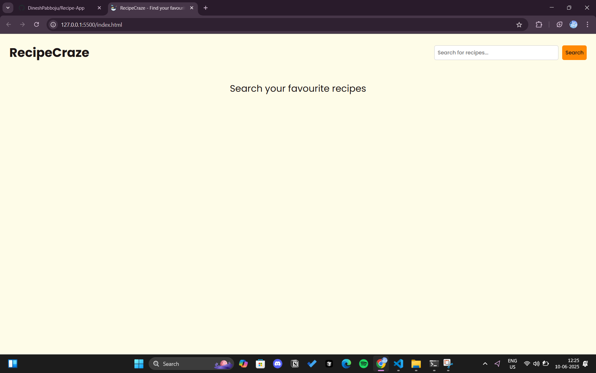
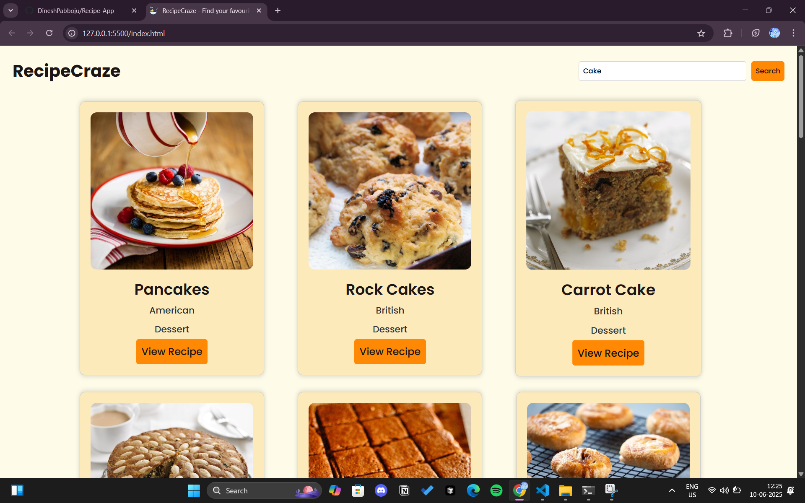

# 🍲 Recipe App

A dynamic and user-friendly recipe application that allows users to search, view, and manage their favorite recipes. Built using modern web technologies with a clean and responsive design.

## 🚀 Features

- 🔍 **Search Recipes**: Find delicious recipes from a public API by name or ingredient.
- 📃 **Recipe Details**: View detailed ingredients, instructions, and images.
- 🌐 **Responsive Design**: Works well on both desktop and mobile devices.

## 🛠️ Tech Stack

- **Frontend**: HTML, CSS, JavaScript
- **API**: [TheMealDB API](https://www.themealdb.com/)
- **Version Control**: Git, GitHub

## 📸 Screenshots

> Add screenshots here if available.
> Example:
> 
> 

## 🎥 Video Demo

📽️ [Click here to watch the demo video](preview/recipeappDemo.mp4)


## 📦 Installation

1. **Clone the repository:**

   ```bash
   git clone https://github.com/DineshPabboju/Recipe-App.git
   ```
2. Navigate into the project directory:

  ```bash
    cd Recipe-App
    Open index.html in your browser
  ```
📁 Folder Structure
``` bash
Recipe-App/
│
├── css/
│   └── styles.css          # Main styling
│
├── js/
│   └── app.js              # Application logic
│
├── assets/                 # App images and assets
│
├── index.html              # Entry point
├── preview/                # Screenshots and Video Demo
└── README.md               # Project overview
You can directly open index.html with any browser or use a live server extension in VS Code.
```

🧪 Usage
Type a recipe name or ingredient in the search bar.

Click on any recipe to view full details.

Click the ❤️ icon to add recipes to your favorites list.

💡 Future Enhancements
User authentication for personalized experience

Upload and manage custom recipes

Dark mode toggle

Filter recipes by category or region

🤝 Contributing
Contributions are welcome! If you'd like to improve this project:

Fork the repository

Create a new branch (git checkout -b feature-name)

Make your changes

Commit and push (git commit -m 'Add feature' && git push)

Create a Pull Request

📄 License
This project is open-source and available under the MIT License.
